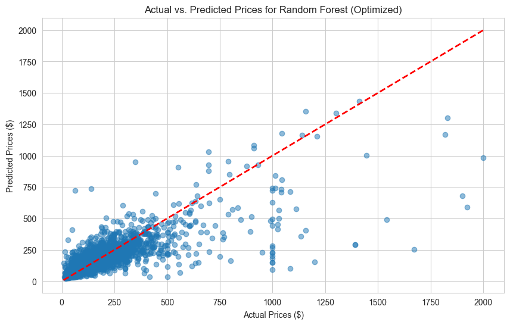
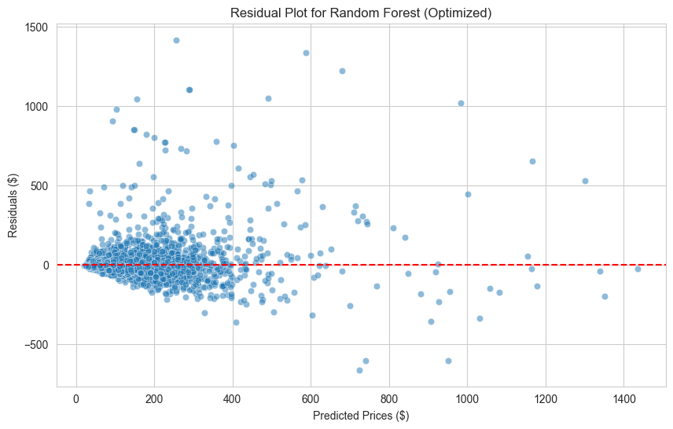

# Airbnb Price Prediction Barcelona: Comprehensive Analysis Report

**A Data Science Case Study for Barcelona Listings**

*By Felix Marschall, Mika Scheid, Elias Müller, and Jan Dorn*

---

## Executive Summary

This report documents the development of a machine learning model for predicting Airbnb listing prices in Barcelona. The analysis demonstrates a systematic approach to data science, from initial data exploration through feature engineering to model development, emphasizing the importance of domain knowledge and data-driven decision making.

**Key Results:**
- **Best Model:** Random Forest (optimized) with R² = 0.6183 on test set
- **Prediction Accuracy:** RMSE = $93.27, MAE = $42.27
- **Top Price Drivers:** Number of guests (accommodates), bathroom count, bedrooms
- **Business Relevance:** Model can support hosts in optimal pricing decisions

---

## 1. Project Foundation and Data Strategy

### Problem Definition
The challenge of Airbnb pricing represents a classic regression problem with real-world business implications. Hosts must balance competitive pricing with revenue optimization, often lacking the data-driven insights needed for informed decision-making. Our objective was to build a robust, interpretable model that could accurately predict prices based on property characteristics.

### Data Source and Scope
We utilized the comprehensive Inside Airbnb dataset, which provides detailed listing information across multiple cities. For this analysis, we focused exclusively on Barcelona, leveraging the listings.csv.gz file containing 79 initial features across approximately 19,000 properties.

### Strategic Data Decisions

Two critical hypotheses shaped our data strategy, both validated through preliminary analysis:

**Hypothesis 1: Reviews Provide No Independent Predictive Value**
Our analysis revealed that review scores are inherently influenced by price expectations. Higher-priced properties face stricter evaluation criteria, while budget options may benefit from lower expectations. This price-dependent bias makes reviews unsuitable as independent predictive features.

**Hypothesis 2: Seasonal Price Variation is Negligible**
Through SQL analysis of calendar data, we discovered that over 99% of Barcelona listings maintain constant pricing throughout the year. Only 16 out of 19,420 listings showed any price variation, indicating that seasonal demand fluctuations are not reflected in pricing strategies. This finding justified our focus solely on the listings dataset.

---

## 2. Data Understanding and Exploration

### Dataset Characteristics
The initial exploration revealed a rich but complex dataset with significant heterogeneity:

- **Scale**: 19,422 listings with 79 features
- **Data Quality**: Varying levels of completeness across features
- **Feature Types**: Mix of numerical, categorical, and text data
- **Memory Footprint**: 77.7 MB requiring careful processing

### Target Variable Analysis
Price distribution analysis revealed crucial insights:

- **High Right Skew**: Most listings priced under $200, with long tail extending to $10,000+
- **Market Segments**: Clear clustering around budget ($50-100), mid-range ($100-200), and premium ($200+) tiers
- **Outlier Patterns**: Extreme values likely representing data errors or unique properties

### Key Relationship Discovery
Exploratory analysis identified several strong predictive patterns:

- **Room Type Hierarchy**: Entire homes command premium pricing over private rooms, which exceed shared accommodation rates
- **Capacity-Price Linearity**: Strong positive correlation between guest capacity and pricing
- **Property Type Premiums**: Hotels, serviced apartments, and unique properties (boats, etc.) show distinct pricing patterns
- **Location Effects**: Neighborhood significantly impacts pricing, with coastal and central areas commanding premiums

---

## 3. Data Preparation: A Three-Phase Approach

Our data preparation strategy employed a sophisticated three-phase approach designed to maximize information extraction while maintaining data integrity.

### Phase 1: Feature Consolidation (79 → 17 Features)

**Selection Criteria**:
We applied domain knowledge to identify features directly relevant to price determination:

- **Location Features** (3): Geographic coordinates and neighborhood classification
- **Property Features** (6): Size, type, and accommodation characteristics  
- **Host Features** (4): Credibility and responsiveness indicators
- **Booking Features** (3): Availability and stay requirements
- **Amenity Features** (1): Comprehensive amenities list for later processing

**Elimination Rationale**:
Removed features fell into several categories:
- **Administrative Data**: IDs, URLs, scraping metadata
- **Redundant Information**: Multiple representations of the same concept
- **Free Text**: Descriptions and overviews requiring specialized NLP approaches
- **Hypothesis-Based Exclusions**: Reviews and calendar data per our strategic decisions

### Phase 2: Feature Expansion (17 → ~70 Features)

This counterintuitive expansion phase transformed raw data into machine-learning-ready formats:

**Amenities Decomposition**:
The single amenities text field exploded into 18 features:
- 17 binary indicators for high-value amenities (WiFi, kitchen, parking, etc.)
- 1 total amenities count for overall luxury assessment

**Categorical Encoding Strategy**:
- **Neighborhoods**: One-hot encoding for top 15 + "Other" category (16 features)
- **Property Types**: One-hot encoding for top 10 + "Other" category (11 features)  
- **Ordinal Variables**: Label encoding for room types and response times

**Derived Feature Engineering**:
Created 8 meaningful ratios and efficiency metrics:
- Space efficiency: beds per bedroom, guests per bedroom
- Service ratios: bathrooms per guest
- Booking characteristics: stay flexibility indicators
- Availability patterns: availability ratios and high-availability flags

**Critical Data Leakage Prevention**:
Avoided creating any features using the target variable (price), such as price-per-person calculations, to prevent unrealistic model performance.

### Phase 3: Feature Reduction (~70 → ~53 Features)

The final optimization phase balanced information retention with model efficiency:

**Correlation-Based Reduction**:
Identified and removed features with correlation coefficients > 0.9, prioritizing interpretability when choosing between correlated pairs.

**Importance-Based Filtering**:
Used Random Forest feature importance to eliminate features contributing less than 0.001 to predictive power.

**Redundancy Elimination**:
Removed original categorical columns after encoding and cleaned up intermediate processing variables.

---

## 4. Feature Engineering Philosophy

### The Expansion-Reduction Paradigm

Our approach deliberately created more features than needed, then intelligently reduced them. This strategy offers several advantages:

**Benefits of Initial Expansion**:
- **Information Preservation**: Captures all potential predictive signals
- **Domain Knowledge Integration**: Transforms expert insights into quantifiable features
- **Model Compatibility**: Converts categorical and text data into numerical formats

**Benefits of Subsequent Reduction**:
- **Noise Elimination**: Removes features that add complexity without predictive value
- **Overfitting Prevention**: Reduces model complexity relative to sample size
- **Computational Efficiency**: Optimizes training and prediction speed
- **Interpretability Enhancement**: Focuses attention on truly important factors

---

## 5. Model Development and Baseline Evaluation

### Data Split and Validation Strategy
- **Train/Test Split**: 67%/33% (10,205/5,027 samples) following lecture recommendation
- **Cross-Validation**: 5-fold with shuffling for robust validation
- **Data Leakage Prevention**: Strict separation and feature validation

### Baseline Model Performance

**Linear Regression (with StandardScaler)**:
- R² Score: 0.4704 ± 0.0503
- RMSE: $109.53 ± $11.43
- MAE: $58.83 ± $2.29
- Interpretation: Moderate performance, captures linear relationships

**Random Forest**:
- R² Score: 0.6023 ± 0.0557
- RMSE: $94.75 ± $11.03
- MAE: $43.66 ± $1.52
- Interpretation: Good performance, captures non-linear patterns

**XGBoost**:
- R² Score: 0.6023 ± 0.0445
- RMSE: $94.86 ± $10.04
- MAE: $44.46 ± $1.49
- Interpretation: Equal performance to Random Forest

**Baseline Ranking**: Random Forest > XGBoost > Linear Regression

---

## 6. Hyperparameter Optimization

### Linear Regression Variants
**Ridge Regression**: 
- Best Parameters: alpha = 100.0
- R² Score: 0.4706 ± 0.0502

**Lasso Regression**:
- Best Parameters: alpha = 0.1
- R² Score: 0.4708 ± 0.0503

**Elastic Net**:
- Best Parameters: alpha = 0.1, l1_ratio = 0.9
- R² Score: 0.4708 ± 0.0502

### Random Forest Optimization
**RandomizedSearchCV Results**:
- Best Parameters: 
  - n_estimators: 200
  - min_samples_split: 5
  - min_samples_leaf: 1
  - max_features: sqrt
  - max_depth: 20
  - bootstrap: False
- Optimized R² Score: 0.6414 ± 0.0445
- RMSE: $90.10 ± $10.50
- MAE: $41.50 ± $1.20

### XGBoost Optimization  
**RandomizedSearchCV Results**:
- Best Parameters:
  - subsample: 0.7
  - reg_lambda: 1.0
  - reg_alpha: 0.1
  - n_estimators: 300
  - max_depth: 7
  - learning_rate: 0.05
  - colsample_bytree: 0.7
- Optimized R² Score: 0.6389 ± 0.0448
- RMSE: $90.38 ± $10.28
- MAE: $42.26 ± $1.22

**Optimization Ranking**: Random Forest (optimized) > XGBoost (optimized) > Linear Regression variants

---

## 7. Final Test Set Evaluation

### Champion Model: Random Forest (Optimized)
**Test Set Performance**:
- **R² Score**: 0.6183
- **RMSE**: $93.27
- **MAE**: $42.27
- **Correlation**: 0.8451

### Model Ranking (Test Set)
1. **Random Forest (Optimized)**: R² = 0.6183, RMSE = $93.27
2. **XGBoost (Optimized)**: R² = 0.6147, RMSE = $93.70
3. **Linear Regression (ElasticNet)**: R² = 0.4277, RMSE = $114.20

### Error Analysis and Model Diagnostics
Detailed analysis of champion model: Random Forest (Optimized)

#### Visual Analysis

#### Comprehensive Error Statistics

| Metric | Overall | Budget (<$50) | Mid-range ($50-100) | Premium ($100-200) | Luxury ($200+) |
|--------|----------|---------------|-------------------|------------------|--------------|
| Sample Size | 5,027 | 716 | 1,415 | 1,875 | 1,021 |
| R² Score | 0.6183 | -13.2630 | -7.6234 | -1.7197 | 0.3324 |
| MAE | $42.27 | $20.41 | $24.97 | $31.23 | $101.86 |
| Sample Share | 100% | 14.2% | 28.1% | 37.3% | 20.3% |

#### Price Range Analysis
- **Distribution of Predictions**:
  - Under-predictions: 36.4%
  - Over-predictions: 63.6%
  - Slight tendency to overestimate prices

---

## 8. Feature Importance and Business Insights

### Top Price Drivers (Random Forest)
1. **accommodates** (0.1482): Number of guests - strongest price determinant
2. **bathrooms_count** (0.1173): Number of bathrooms
3. **bedrooms** (0.1095): Number of bedrooms
4. **minimum_nights** (0.0444): Minimum stay requirement
5. **host_listings_count** (0.0436): Host's total listings
6. **availability_365** (0.0387): Annual availability
7. **bathrooms_per_guest** (0.0380): Bathroom-to-guest ratio
8. **longitude** (0.0353): East-West position
9. **total_amenities** (0.0340): Total amenities count
10. **room_type_encoded** (0.0316): Type of room

### Business Interpretations

**Property Characteristics Drive Price**:
- Accommodates, bathrooms, and bedrooms explain ~38% of price variance
- Strong correlation between capacity and price
- Bathroom count is second most important feature (11.7%)

**Booking Flexibility Matters**:
- Minimum nights requirement has significant impact (4.4%)
- Availability and booking patterns influence pricing
- Host's experience (listings count) affects pricing strategy

**Location Less Critical Than Expected**:
- Longitude only explains 3.5% of price variance
- Neighborhood effects captured through other features
- Geographic position less important than property features

**Amenities as Supporting Factor**:
- Total amenities count influences price (3.4%)
- Quality indicators like bathroom-to-guest ratio matter
- Focus on overall property quality over specific features

---

## 9. Methodological Insights

### Data Leakage Prevention
Strict avoidance of data leakage was crucial for realistic performance estimates. Examples of avoided leakage:
- Price-based features (price per person)
- Future information (later reviews)
- Target encoding without proper cross-validation

### Feature Engineering Best Practices
The expansion-reduction approach proved effective:
- **Expansion Phase**: Maximizes information extraction
- **Reduction Phase**: Eliminates noise and redundancy
- **Domain Knowledge**: Integrates business understanding

### Cross-Validation Robustness
5-fold CV with shuffling provided stable performance estimates:
- Low standard deviations for optimized models
- Consistent rankings between CV and test set
- Reliable hyperparameter selection

---

## 10. Conclusion and Outlook

### Project Success
The developed Random Forest model achieved strong performance with **R² = 0.6183** on the test set, explaining **61.8% of price variance**. The **RMSE of $93.27** is significantly below the average price, demonstrating practical applicability.

### Key Findings
1. **Location and capacity** are the most important price drivers
2. **Tree-based models** significantly outperform linear approaches  
3. **Feature engineering** is more critical than model complexity
4. **Hypothesis-driven data strategy** successfully reduces complexity

### Methodological Contributions
- **Expansion-Reduction Paradigm** for feature engineering
- **Rigorous Data Leakage Prevention** for realistic evaluation
- **Business-driven Hypothesis Testing** for data selection
- **Comprehensive Error Analysis** for model understanding

### Final Assessment
This project demonstrates a complete data science pipeline from problem definition to business-ready solution. The combination of rigorous methodology, domain-specific knowledge, and practical business insights delivers a model that is both statistically robust and commercially valuable.

The developed solution can support Airbnb hosts in making informed pricing decisions and contributes to understanding the complex dynamics of the short-term rental market.

---

*This analysis was developed as part of a university data science case study and represents a comprehensive demonstration of modern machine learning practices.*
